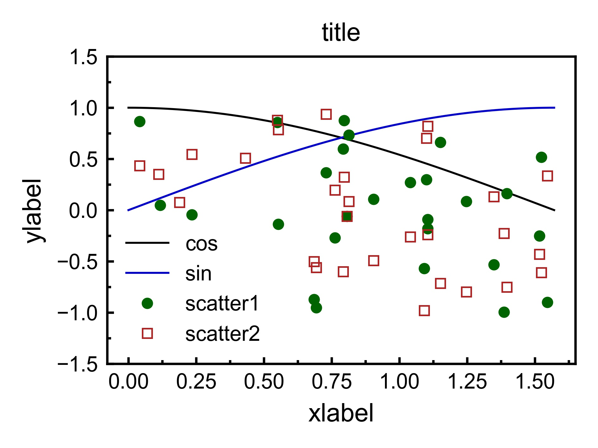

# prettympl

A simple package for prettier matplotlib plot

## Features
- 별도의 설치 없이 리눅스에서도 사용 가능한 다양한 폰트 내장 \
  (사용 가능한 폰트 이름은 `prettympl._available_fonts` 변수 확)
- Context 기반의 플롯 스타일 설정


## Requirements
- python >= 3.6
- matplotlib

## Installation
1. 소스 코드를 다운받고 `setup.py`가 있는 경로로 이동
2. 해당 경로에서 `pip install .` (python 3 버전을 명시해야 할 경우는 `python3 -m pip install .`)

## Usage
각 스타일별로 클래스가 있음. (현재 `SimpleWhite`만 작성됨) \
해당 스타일을 `with`문으로 생성해서 해당 구문 내에서 스타일이 적용된 plot을 생성할 수 있다.
```python3
import matplotlib.pyplot as plt
from prettympl import SimpleWhite
import numpy as np

x1 = np.linspace(0, np.pi / 2, 200)
x2 = np.random.uniform(0, np.pi / 2, 30)
y1 = np.cos(x1)
y2 = np.sin(x1)
y3 = np.random.uniform(-1,1,30)
y4 = np.random.uniform(-1,1,30)

with SimpleWhite(font_family='Arial'): # Simplewhite 스타일 사
    plt.figure()
    plt.title("title")
    plt.xlabel("xlabel")
    plt.ylabel("ylabel")
    plt.plot(x1, y1, label='cos')
    plt.plot(x1, y2, label='sin')
    plt.plot(x2, y3, 'o', label='scatter1')
    plt.plot(x2, y4, 's', mfc='none', label='scatter2')
    plt.ylim(-1.5, 1.5)
    plt.legend(edgecolor='none')

# !중요! 다음 두 함수는 with문 밖에서 call해야 함.
plt.savefig("prettympl.jpg", dpi=600)
plt.show()
```
결과는 다음과 같다.
